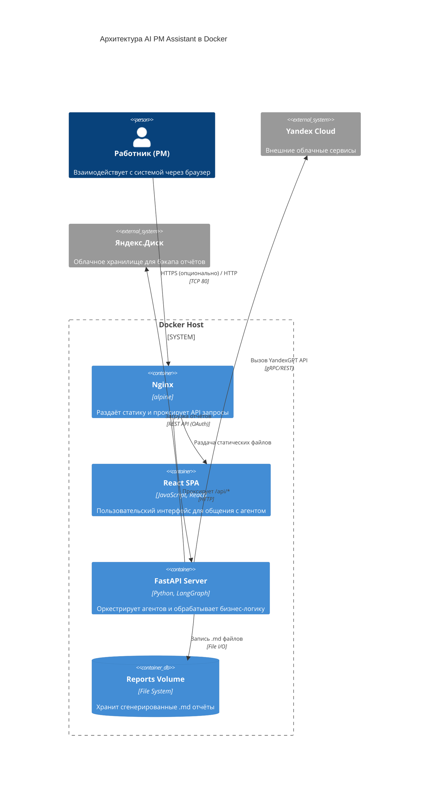
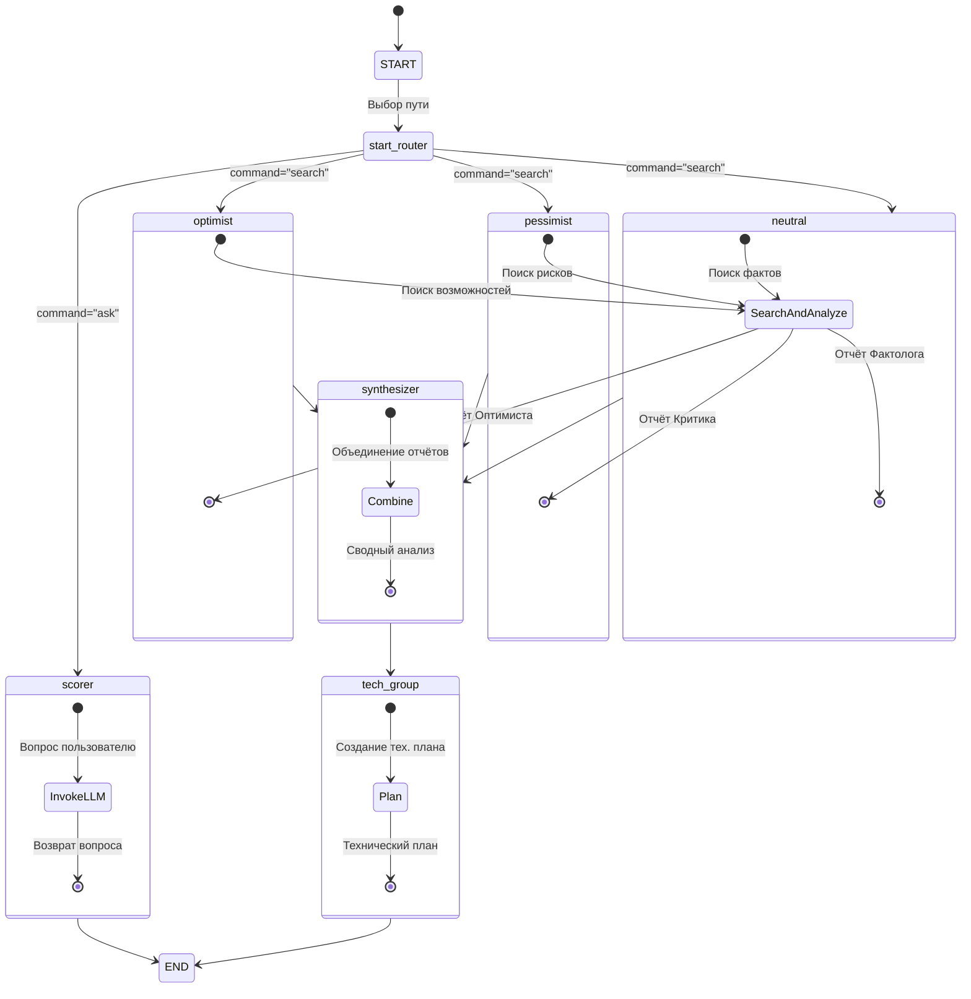
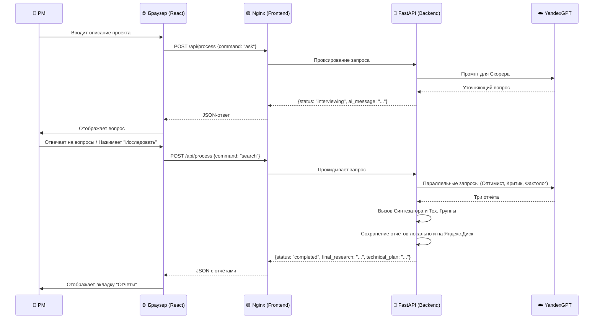
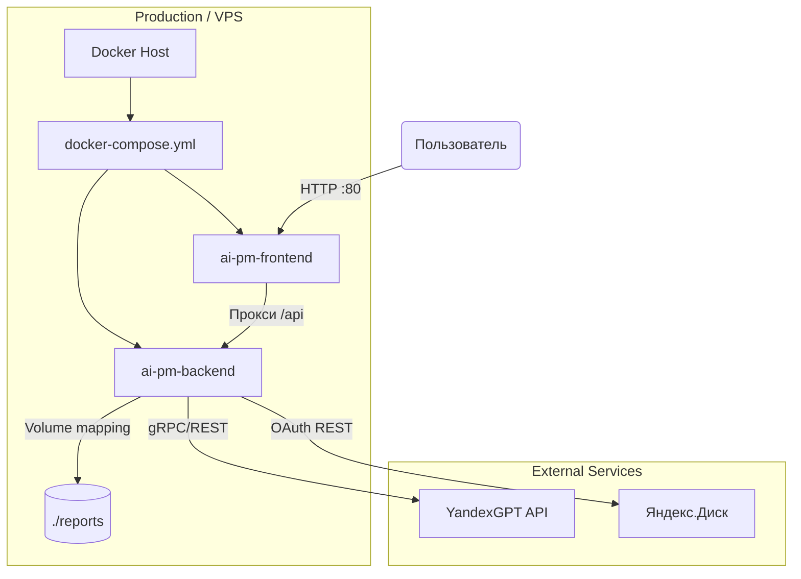
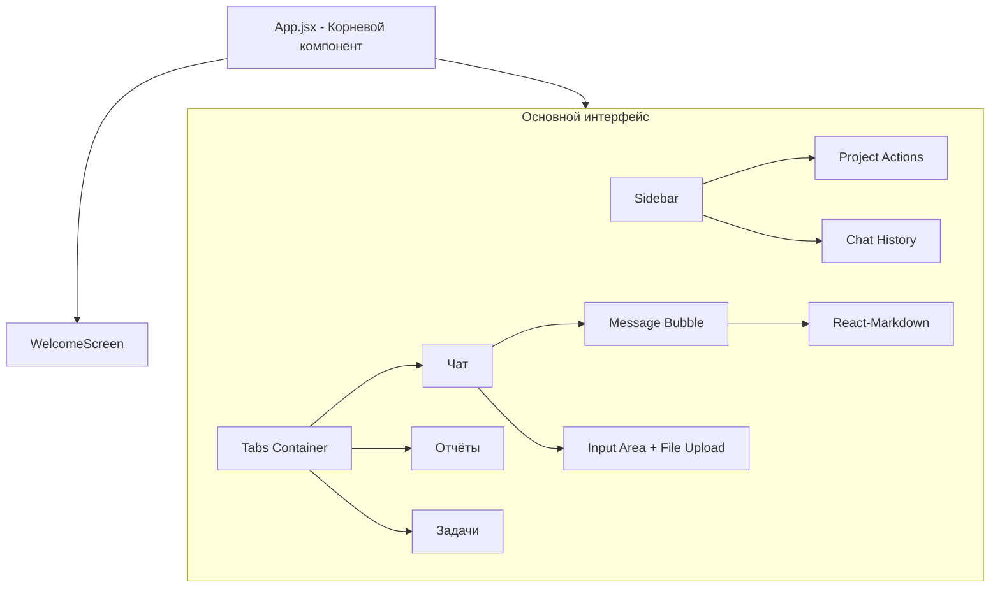
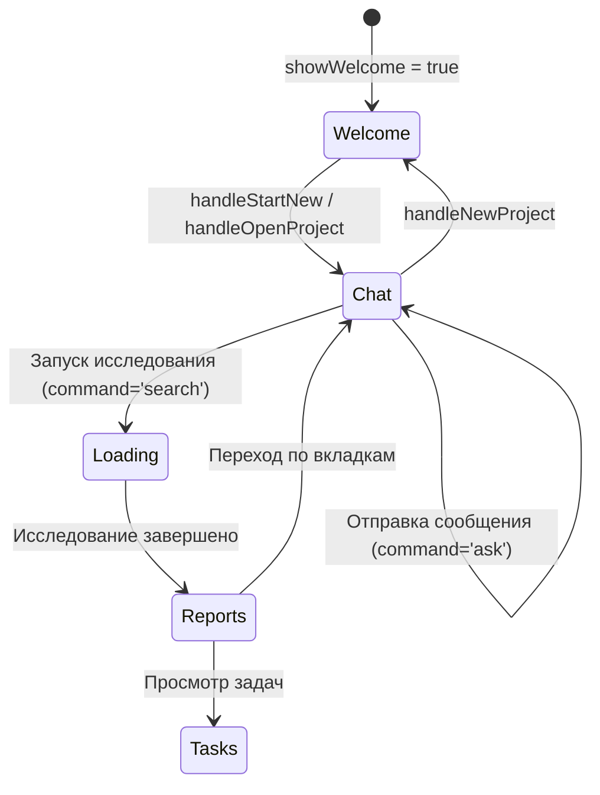

# 🏗 Архитектура AI Project Manager Assistant

## 1. Общий обзор

AI Project Manager Assistant — это мультиагентная   система, предназначенная для анализа и планирования IT-проектов в полуавтоматическом режиме. Система построена на микросервисной архитектуре, разворачиваемой с помощью Docker Compose, и состоит из двух основных частей: **фронтенда** (React + Nginx) и **бэкенда** (FastAPI + LangGraph). В качестве LLM используется YandexGPT.

## 2. Диаграмма компонентов (C4 Model - Уровень контейнеров)



## 3. Внутренняя архитектура бэкенда (LangGraph)

Сердцем системы является граф агентов, построенный на **LangGraph**. Он управляет состояниями и переходами между различными AI-агентами.

### Диаграмма потока состояний (StateGraph)



### Роли агентов и их промпты

| Агент | Файл промпта (в `data/prompts.json`) | Задача |
| :--- | :--- | :--- |
| **Скорер (Scorer)** | `scorer` | Генерация уточняющих вопросов для сбора требований. |
| **Оптимист** | `optimist` | Анализ сильных сторон, возможностей и потенциала. |
| **Критик (Pessimist)** | `pessimist` | Выявление рисков, слабых мест и угроз. |
| **Фактолог (Neutral)** | `neutral` | Объективный анализ рынка, конкурентов и технологий. |
| **Синтезатор** | `synthesizer` | Объединение выводов трёх предыдущих агентов в единый структурированный отчёт. |
| **Тех. группа** | `tech_group` | Разработка технического плана и MVP на основе сводного анализа. |

## 4. Интерфейсы взаимодействия (Frontend ↔ Backend)

### Схема потоков данных



### API-контракт

Бэкенд предоставляет единственный основной эндпоинт для всего взаимодействия:

**`POST /api/process`**

**Тело запроса (`ProjectRequest`):**

```json
{
  "project_description": "string",
  "chat_history": "string",
  "command": "ask" | "search",
  "upload_to_disk": boolean
}
```

**Тело ответа (`ProjectResponse`):**

*   **Для `command: "ask"`**
    ```json
    {
      "status": "interviewing",
      "ai_message": "string"
    }
    ```

*   **Для `command: "search"`**
    ```json
    {
      "status": "completed",
      "final_research": "string",
      "technical_plan": "string",
      "local_path": "string",
      "disk_upload": {
        "status": "success" | "failed",
        "share_link": "string?",
        "error": "string?"
      }
    }
    ```

## 5. Модель данных состояния (AgentState)

Состояние, которое передаётся между узлами графа LangGraph, определено в `pipeline.py` как `TypedDict`:

```python
class AgentState(TypedDict):
    project_description: str
    chat_history: str
    last_ai_message: str
    command: str  # "ask" или "search"
    research_optimist: str
    research_pessimist: str
    research_neutral: str
    final_research: str
    technical_plan: str
```

## 6. Стратегия развёртывания (Deployment View)

Проект полностью контейнеризирован и может быть развёрнут в любом окружении с поддержкой Docker.



### Процесс деплоя (из `DEPLOY.md`)

1.  **Подготовка VPS**: Установка Docker и Docker Compose.
2.  **Клонирование**: `git clone <repo>`
3.  **Конфигурация**: Создание файла `.env` с ключами API.
4.  **Запуск**: `docker-compose up -d`

Эта архитектура обеспечивает чёткое разделение ответственности, масштабируемость и простоту развёртывания, что делает систему надёжной и удобной для дальнейшего развития.

Вот продолжение подробного архитектурного документа, охватывающее детали реализации фронтенда, формат обмена данными и инфраструктурные особенности.


## 7. Детальная архитектура фронтенда (React)

Фронтенд построен как одностраничное приложение (SPA) на React и имеет модульную структуру.

### Структура компонентов



### Жизненный цикл состояний в React



### Формат обмена данными с бэкендом

Фронтенд использует `fetch` для отправки запросов на `/api/process`. Вся история диалога хранится в состоянии `projectContext.chatHistory` и сериализуется для бэкенда в строку с помощью `formatChatHistoryForBackend`.

```javascript
// Пример преобразования перед отправкой
const formatChatHistoryForBackend = (history) => {
  return history.map(item =>
    `${item.role === 'user' ? 'User' : 'AI'}: ${item.content}`
  ).join('\n');
};
```

### Экспорт и импорт проектов

Проекты сохраняются в файлы с расширением `.aipm`, которые являются ZIP-архивами в формате JSON. Это позволяет переносить состояние диалога и результаты анализа между сессиями.

**Структура `.aipm` файла:**
```json
{
  "version": "1.0",
  "exportedAt": "2026-04-14T...",
  "messages": [...],
  "chatHistory": [...],
  "reports": {
    "final_research": "...",
    "technical_plan": "..."
  }
}
```
